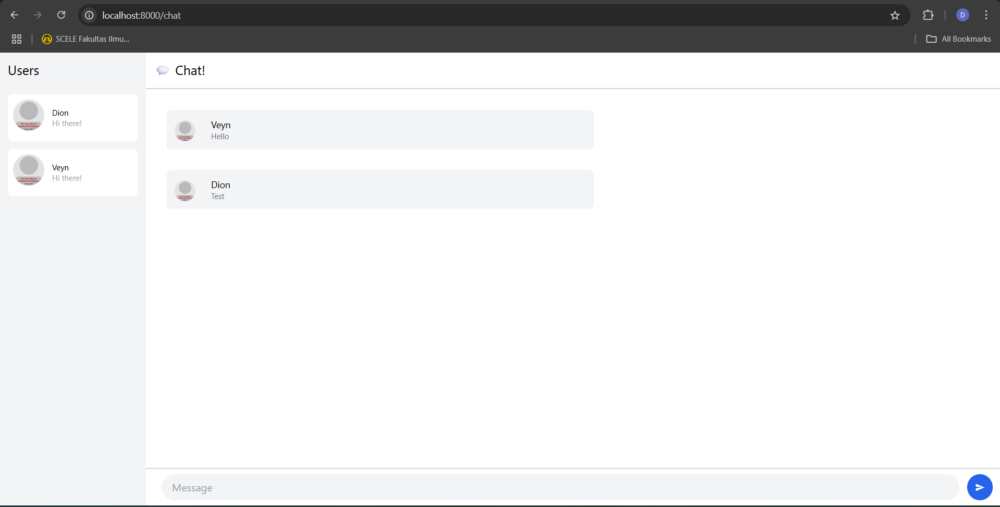

# Module 10

### 3.1 Original Code

### 3.2 Being Creative

I transformed the user interface with a modern design approach, adding vibrant gradient backgrounds and implementing smooth transitions with subtle hover effects for a more dynamic experience. User engagement is enhanced through  redesigned message bubbles that improve conversation flow. To add personality and warmth to the interface, I added some emojis throughout the application. The spacing and layout have been optimized for better visual balance, while buttons and input fields now feature more engaging interactive states.